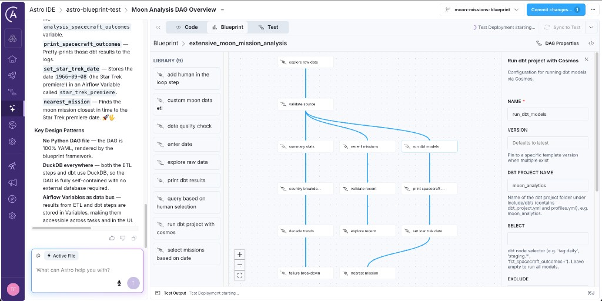

Moon Missions Blueprint Project
================================

This project demonstrates **Airflow Blueprints** using a dataset of every moon mission in history. Airflow Dags can be defined using templates that can be rendered as a no-code Dag authoring interface in the Astro IDE.

> **Note:** This project uses **Airflow Variables** and **DuckDB** instead of an external database to store results. In a real use case you would use an external database with an [Airflow connection](https://www.astronomer.io/docs/astro/create-and-link-connections).



The Dataset
===========

`include/moon_missions.csv` contains lunar missions from Pioneer 0 (1958) through Artemis II (2026), with columns for mission name, launch date, country, operator, carrier rocket, spacecraft, mission type, outcome, crewed status, and a description.

`include/moon_merch_sales.csv` is a second, e-commerce style dataset: fake order lines for moon-mission themed merchandise (apparel, models, books, posters, collectibles). Columns include `order_line_id`, `order_id`, `order_date`, `customer_region`, `product_name`, `category`, `quantity`, `unit_price_usd`, and `line_revenue_usd`. The bundled file covers a **full calendar year** (2025) with about one to four orders per day so row counts look realistic; use it for revenue and time-bucket exercises without mixing merch logic into the science mission table.

Dags
====

### 1. `get_moon_mission_summary_stats`: Basic ETL

Extracts the CSV, runs a SQL aggregation via DuckDB (total missions, successful vs. not, crewed vs. uncrewed), and stores the result in an Airflow Variable. **Try changing the SQL** in the YAML to compute different statistics.

### 2. `explore_moon_mission_raw_data`: Data Explorer

Prints the dataset schema and the first 5 rows to the Airflow logs. Useful for understanding the data before writing queries. Trigger manually.

### 3. `get_moon_mission_summary_stats_with_quality_checks`: ETL with Data Quality Checks

Runs column-level checks (unique on `mission_number`, not-null on key columns) and a table-level check (`COUNT(*) >= 100`) before executing the same ETL aggregation. All checks pass on the included CSV.

### 4. `my_moon_mission`: Birthday Mission Finder (Exercise)

An interactive exercise Dag with two steps already built (explore + validate) and two for you to add. Change the commented-out steps to enter your birthday and find all moon missions from your birth decade. See the instructions inside the YAML file.

### 5. `get_moon_mission_country_stats`: Country Statistics

A more complex ETL Dag with three steps: data quality checks fan into two parallel ETL branches. One computes per-country totals (total missions, successful, success rate). The other finds the most common country, operator, carrier rocket, and spacecraft across all missions.

### 6. `moon_missions_hitl`: Human-in-the-Loop Spacecraft Explorer

A human-in-the-loop Dag that reads all unique spacecraft names from the CSV and presents them as selectable options in the Airflow UI. After you pick one or more spacecraft, the selection is stored in a Variable and a downstream step queries and logs all missions for your chosen spacecraft.

### 7. `run_moon_mission_dbt_models`: dbt + Cosmos

Runs a dbt project (`include/dbt/moon_analytics`) via Astronomer Cosmos with DuckDB as the warehouse. The dbt models stage the raw CSV, compute intermediate aggregations by spacecraft type, and produce a final `fct_spacecraft_outcomes` fact table. Results are stored in an Airflow Variable and pretty-printed to the logs.

### 8. `extensive_moon_mission_analysis`: Showcase Pipeline

A comprehensive weekly Dag that ties everything together. After exploring and validating the data, it fans into three parallel branches: (A) a statistics cascade computing summary stats, country breakdowns, decade trends, and failure analysis; (B) a recent-missions pipeline filtering to post-2020 launches; and (C) a dbt + Cosmos branch that also finds the moon mission closest to the Star Trek premiere date (1966-09-08).

### 9. `solution_blueprint_tutorial`: Merchandise Tutorial (solution Dag)

**Solution** to the Blueprint tutorial: **`extract_and_aggregate`** runs first (pick **week**, **month**, or **quarter**; revenue per calendar bucket into a small JSON list in an Airflow Variable), then **`row_count_check`** validates that **loaded** JSON (row count, non-null keys, unique period keys — not the raw CSV), and **`print`** pretty-prints the same Variable to the logs. DuckDB scans the CSV inside the ETL task; only aggregates are persisted to Variables. Build your own Dag in the IDE to practice; compare against this file when you are done.

Blueprint Templates
===================

| Template | File | What it does |
|----------|------|--------------|
| `custom_moon_data_etl` | `dags/templates/etl_blueprints.py` | CSV, DuckDB SQL, Airflow Variable |
| `extract_and_aggregate` | `dags/templates/aggregate_blueprints.py` | CSV revenue summed by week / month / quarter → Variable |
| `explore_raw_data` | `dags/templates/explorer_blueprints.py` | Pretty-print schema and sample rows |
| `sql_data_quality_check` | `dags/templates/quality_blueprints.py` | Column and table SQL checks on a CSV via DuckDB; optional `min_rows` |
| `row_count_check` | `dags/templates/quality_blueprints.py` | Row count, non-null keys, and unique keys on JSON in a Variable (post-ETL) |
| `enter_date` | `dags/templates/date_blueprints.py` | Store a date in an Airflow Variable |
| `select_missions_based_on_date` | `dags/templates/date_blueprints.py` | Select missions by date (closest, year, or decade) |
| `add_human_in_the_loop_step` | `dags/templates/hitl_blueprints.py` | Present CSV column values as HITL options, store selection |
| `query_based_on_human_selection` | `dags/templates/hitl_blueprints.py` | Filter CSV by a stored selection and log results |
| `run_dbt_project_with_cosmos` | `dags/templates/cosmos_blueprints.py` | Run dbt models via Astronomer Cosmos; set `dbt_project_name` for the folder under `include/dbt/` |
| `print` | `dags/templates/cosmos_blueprints.py` | Pretty-print JSON rows from an Airflow Variable |

dbt Project
===========

The embedded dbt project lives at `include/dbt/moon_analytics/` and uses DuckDB so no external warehouse is needed. The model graph is:

```
stg_moon_missions (view)
  └─> int_missions_by_spacecraft (view)
  └─> int_spacecraft_failure_details (view)
        └─> fct_spacecraft_outcomes (table)
```

- **stg_moon_missions**: Reads the CSV, casts types, extracts a `spacecraft_type` from the first word of the spacecraft name.
- **int_missions_by_spacecraft**: Counts total/successful/failed missions per spacecraft type.
- **int_spacecraft_failure_details**: Lists individual failure details per spacecraft type.
- **fct_spacecraft_outcomes**: Joins the two intermediate models to produce mission and spacecraft success rates per spacecraft type.

Project Structure
=================

```
blueprint/
├── dags/
│   ├── loader.py                                # Entry point: build_all()
│   ├── moon_missions_etl.dag.yaml               # Basic ETL pipeline
│   ├── explore_moon_missions.dag.yaml           # Data explorer
│   ├── moon_missions_quality_etl.dag.yaml       # ETL + quality checks
│   ├── my_moon_mission.dag.yaml                 # Birthday mission finder (exercise)
│   ├── moon_missions_country_stats.dag.yaml     # Country stats + most common
│   ├── moon_missions_hitl.dag.yaml              # HITL spacecraft explorer
│   ├── run_moon_mission_dbt_models.dag.yaml     # dbt + Cosmos pipeline
│   ├── extensive_moon_mission_analysis.dag.yaml # Showcase: all blueprints combined
│   ├── solution_blueprint_tutorial.dag.yaml     # Merch tutorial solution Dag
│   └── templates/
│       ├── etl_blueprints.py                    # CustomMoonDataEtl
│       ├── aggregate_blueprints.py              # ExtractAndAggregate
│       ├── explorer_blueprints.py               # ExploreRawData
│       ├── quality_blueprints.py                # SqlDataQualityCheck, RowCountCheck
│       ├── date_blueprints.py                   # EnterDate, SelectMissionsBasedOnDate
│       ├── hitl_blueprints.py                   # AddHumanInTheLoopStep, QueryBasedOnHumanSelection
│       └── cosmos_blueprints.py                 # RunDbtProjectWithCosmos, Print
├── include/
│   ├── moon_missions.csv                        # The dataset (148 missions)
│   ├── dbt/moon_analytics/                      # dbt project (DuckDB)
│   │   ├── dbt_project.yml
│   │   ├── profiles.yml
│   │   └── models/
│   │       ├── staging/stg_moon_missions.sql
│   │       ├── intermediate/int_missions_by_spacecraft.sql
│   │       ├── intermediate/int_spacecraft_failure_details.sql
│   │       └── marts/fct_spacecraft_outcomes.sql
│   └── operators/
│       ├── etl_operators.py
│       ├── explorer_operators.py
│       ├── quality_operators.py
│       ├── date_operators.py
│       └── hitl_operators.py
├── Dockerfile
├── requirements.txt
└── tests/
```

Adding Your Own Blueprints
==========================

1. Create a new Python file in `dags/templates/`.
2. Define a config class inheriting `BaseModel` with `Field(...)` for each parameter.
3. Define a blueprint class inheriting `Blueprint[YourConfig]` with a `render()` method.
4. Reference the blueprint by its snake_case name in any `*.dag.yaml` file.
5. **Generate schemas for IDE discovery.** For the Astro IDE to list your blueprint in the library, generate JSON schemas into `generated-schemas/`. Run the Blueprint CLI once per blueprint (use each template’s snake_case name):

   ```bash
   blueprint schema extract > generated-schemas/extract.schema.json
   blueprint schema load > generated-schemas/load.schema.json
   ```

   Replace `extract` and `load` with your blueprint names, for example:

   ```bash
   blueprint schema custom_moon_data_etl > generated-schemas/custom_moon_data_etl.schema.json
   ```

   Commit the files under `generated-schemas/` so the IDE can discover them.
